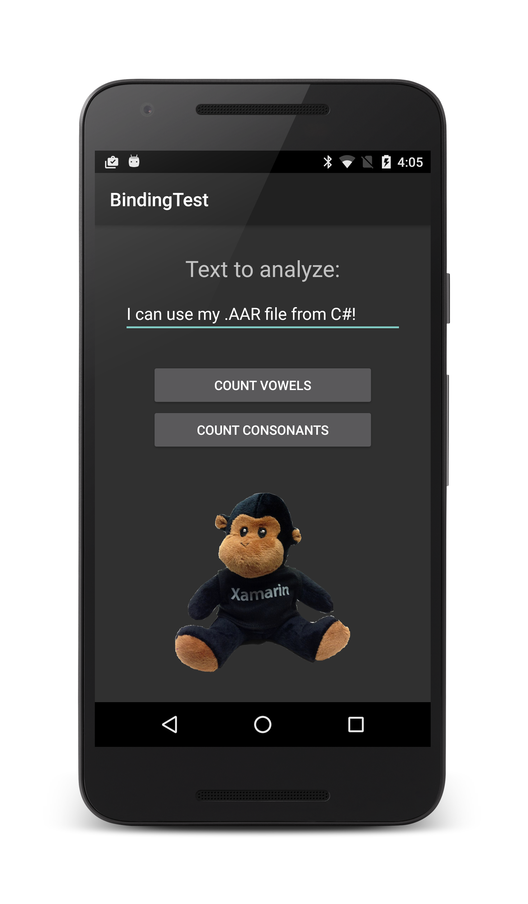

# Binding an .AAR Example

This sample app accompanies
[Binding an .AAR](https://docs.microsoft.com/en-us/xamarin/android/platform/binding-java-library/binding-an-aar).

This sample can help you understand how a Xamarin.Android application
can reuse existing Java code that is packaged in an Android .AAR. This
sample also demonstrates how to access and use .AAR resources.

The `MainActivity` of the app prompts the user for a string and uses a
`TextCounter` class within the .AAR to count the number of vowels and
consonants in the string. (The Android Studio project and Java source
for the .AAR is included.) In addition, an image resource is retrieved
from the .AAR to assist in displaying the count results.

Most of the "heavy lifting" is done by the .AAR. The example app simply
accepts input from the user, sends it to the .AAR for text analysis,
then displays results.

Two projects are contained in this solution. The `AarBinding` project
is the Binding Project that wraps the `textanalyzer.aar` file, and the
`BindingTest` project is the test app that references `AarBinding`.

