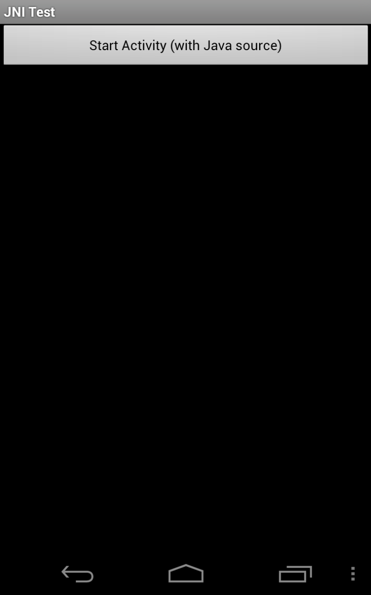
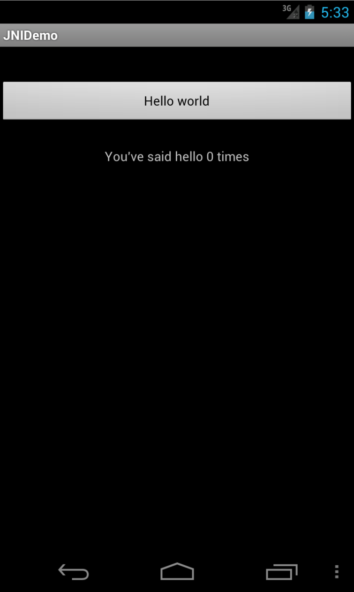

# Java Native Invoke Sample

This sample shows how to manually bind to a Java library so it can
be consumed by a Xamarin.Android application.

## Requirements

**$ANDROID_SDK_PATH** is the directory that contains your Android SDK installation.

## How it works

As Xamarin.Android does not support binding arbitrary .jar
files (only the Android SDK android.jar is bound), alternative
mechanisms must instead be used for interoperation between Java and
managed code. Two primary mechanisms are:

 1. `Android.Runtime.JNIEnv` for creating instances of Java objects and
    invoking methods on them from C#.  This is very similar to
    `System.Reflection` in that everything is string based and thus
    untyped at compile time.

 2. The ability to include Java source code and .jar files into the
    resulting Android application.

This sample uses mechanism (2) to demonstrate the Java Native Invoke (JNI) capability.

The Java source code is kept in **MyActivity.java**, which is included
in the project with a **Build Action** of **AndroidJavaSource**.

Furthermore, edit **Properties\AndroidManifest.xml** so that it
contains one additional element:

1. A `/manifest/application/activity` element must be created so that
    we can use `Context.StartActivity()` to create the custom activity.

This translates to having the following XML in
**AndroidManifest.xml**:

```xml
<application android:label="Managed Maps">
    <uses-library android:name="com.google.android.maps" />
    <activity android:name="mono.samples.jnitest.MyActivity" />
</application>
<uses-permission android:name="android.permission.INTERNET" />
```

**MyActivity.java** uses the **Resources\Layout\HelloWorld.axml** resource, which
contains a LinearLayout with a Button and a TextView.

**Activity1.cs** uses `Java.Lang.Class.FindClass()` to obtain a
`Java.Lang.Class` instance for the custom `MyActivity` type, then we
create an `Intent` to pass to `Activity.StartActivity()` to launch
`MyActivity`.

 
