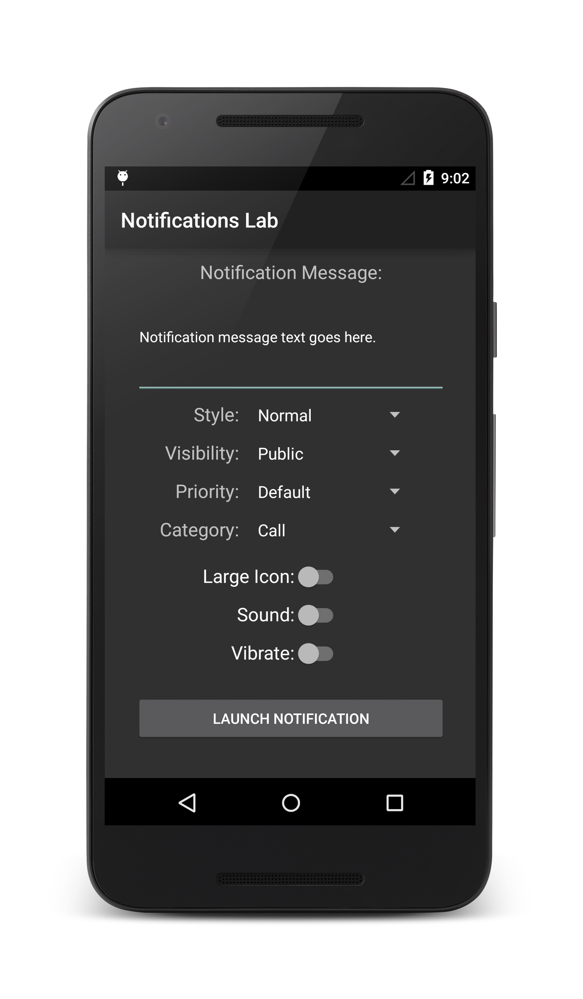

# Android 5.0 Notifications Lab

This sample app accompanies the article,
[Local Notifications in Xamarin.Android](https://docs.microsoft.com/xamarin/android/app-fundamentals/notifications/local-notifications).
You can use this sample to try out the different notification styles and options
in Android 5.0.

A single screen provides the following options for selecting
the "ingredients" of a notification:

- A textbox to enter the notification text.

- A selector for the notification style (normal, big text, image, inbox).

- A selector for the visibility level of the notification on the
   lockscreen (public, private, secret).

- A selector for the priority of the notification (low, mimimum, default,
   high, maximum).

- A selector for the category of the notification.

- Switches for enabling/disabling large icon, sound, and vibrate
   options.

A launch button is located at the bottom of the screen to post a
notification with the above-selected options.

When you tap on a notification, it takes you to a "SecondActivity" screen
to demonstrate how PendingIntents work.

To build and run this sample, you must first enable Android 5.0 support as
described in
[Setting Up an Android 5.0 Project](https://docs.microsoft.com/en-us/xamarin/android/platform/lollipop#settingup).
You will need an Android device or emulator with a large screen (such as
a Nexus 5 or an AVD with the WXGA720 skin) to view and select from all
of the options.
