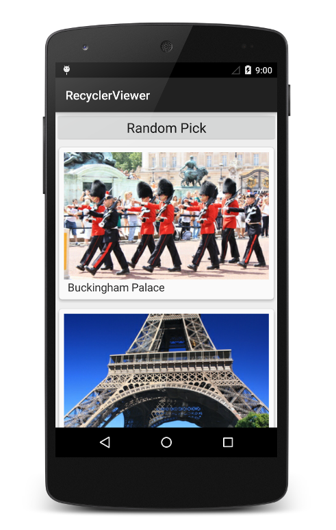

# RecyclerViewer

This sample app accompanies the articles
[CardView](https://docs.microsoft.com/xamarin/android/user-interface/controls/card-view) and
[RecyclerView](https://docs.microsoft.com/xamarin/android/user-interface/layouts/recycler-view/).
You can use this sample to learn how to use the new `CardView` and `RecyclerView` widgets
introduced with Android 5.0 Lollipop.

This app is a simple "Photo Album Viewer" that lets the user scroll up
and down to view a collection of photos. Each photo, which consists of
an image with caption text, is displayed as a row item in the
`RecyclerView`. The **Random Pick** button
randomly swaps a photo in the collection with the first photo to
demonstrate how `RecyclerView` is updated when the data set changes.
When the user taps a photo, a toast appears to display the number of
the photo within the collection &ndash; this demonstrates how item view
click handlers work.

Each image/caption (photo) row item is displayed in a `CardView`
layout, and the app uses a single `RecyclerView` layout to hold and
display over thirty unique row items. An *adapter* is used to connect
the `RecyclerView` with a simple "Photo Album" database, a
*view-holder* is used to cache view references, and a linear *layout
manager* positions the `CardView` row items within the `RecyclerView`.

